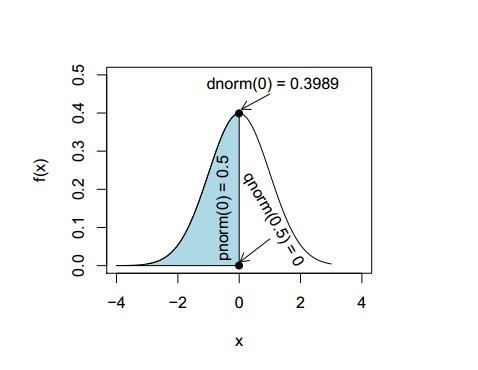
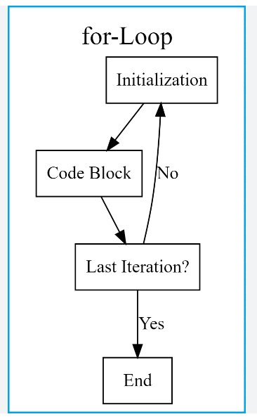

```{r setup, include=FALSE}
knitr::opts_chunk$set(
	echo = TRUE,
	message = FALSE,
	warning = FALSE
)
```

```{r, echo=FALSE, out.width="100%"}

```

> **TEMAS CENTRALES DEL MÓDULO**

> Simulaciones de funciones de distribución

> La familia apply

> Definición de funciones propias

> Procesos iterativos

# Introducción

## Nota

Este capítulo está pensado para aquellos que no son programadores, pero
les seria muy útil conocer algunas herramientas básicas de programación.
A medida que vaya aprendiendo a programar en `R`, descubrirá
progresivamente nuevas formas fascinantes de hacer las cosas que antes
no se habría imaginado. Nunca se aprende a programar del todo.

Para profundizar en programación en `R` recomendamos por ejemplo
bibliografía especifica como:

```{r echo=FALSE}
webshot::webshot("https://csgillespie.github.io/efficientR/index.html", cliprect = c(0, 0, 1000, 1000), )
```

O, este otro libro está diseñado principalmente para usuarios de `R` que
desean mejorar sus habilidades de programación y comprensión del
lenguaje.

```{r echo=FALSE}
webshot::webshot("https://adv-r.hadley.nz/index.html", cliprect = c(0, 0, 1000, 1080), )
```

# Simulaciones de funciones de distribución

La simulación de funciones de distribución puede aplicarse para:

-   Análisis de Monte Carlo:

Puedes utilizar estas funciones para simular datos que siguen una
determinada distribución y realizar análisis de Monte Carlo. Por
ejemplo, si estás estudiando el comportamiento de un sistema financiero,
puedes simular datos aleatorios de una distribución normal para
representar los rendimientos diarios de una acción y luego realizar
miles de simulaciones para evaluar el riesgo y la rentabilidad
potencial.

-   Pruebas de hipótesis:

Puedes generar datos aleatorios bajo una hipótesis nula y utilizarlos
para realizar pruebas de hipótesis. Por ejemplo, si deseas probar si la
media de una muestra es igual a cero, puedes generar datos aleatorios de
una distribución normal con media cero y compararlos con tu muestra
observada utilizando una prueba de hipótesis como la prueba t.

-   Simulación de escenarios:

Puedes utilizar estas funciones para simular diferentes escenarios y
evaluar el impacto de diferentes variables en un sistema o modelo. Por
ejemplo, si estás construyendo un modelo de simulación para predecir el
tiempo de espera en una cola de atención al cliente, puedes generar
datos aleatorios de una distribución exponencial para simular los
tiempos de llegada de los clientes y analizar cómo diferentes tasas de
llegada afectan el tiempo de espera promedio.

-   Estimación de parámetros:

Puedes utilizar estas funciones para generar datos sintéticos y ajustar
modelos estadísticos para estimar los parámetros desconocidos. Por
ejemplo, si estás ajustando un modelo lineal, puedes generar datos
aleatorios siguiendo una distribución normal con ciertos parámetros,
ajustar el modelo a los datos sintéticos y luego comparar los parámetros
estimados con los verdaderos.

Podemos generar datos simulados bajo distintas funciones de
distribución, algunos ejemplos son

| Distribución   | Función en R | Tipo de distribución |
|----------------|--------------|----------------------|
| binomial       | `binom()`    | discreta             |
| chi-squared    | `chisq()`    | continua             |
| F              | `f()`        | continua             |
| hypergeometric | `hyper()`    | discreta             |
| normal         | `norm()`     | continua             |
| Poisson        | `pois()`     | discreta             |
| Student's t    | `t()`        | continua             |
| uniform        | `unif()`     | continua             |

`R` dispone de cuatro funciones de simulación de distribuciones. Se
puede acceder a cada una de ellas simplemente precediendo el nombre de
la distribución que figura en la tabla anterior por la letra que se
indica a continuación:

```{r echo=FALSE, fig.align='center', fig.height=6, fig.width=6, out.width="70%"}

```

*r*: función para simular datos con dicha distribución. *d*: función de
densidad o de probabilidad. *p*: función de distribución. *q*: función
para el cálculo de cuantiles.

Combinando prefijos y sufijos, la función de *densidad\** de una
distribución normal se obtiene con `dnorm()`, la función de
*distribución\*\** con `pnorm()`, los *cuantiles* se calculan mediante
`qnorm()` y los *valores aleatorios* con distribución normal mediante
`rnorm()`.

\*La *función de densidad de probabilidad* de una variable aleatoria
continua describe la probabilidad relativa de que dicha variable tome
determinado valor.

\*\*Para cualquier variable aleatoria $X$ evaluada en un valor $x$, la
*función de distribución acumulada* describe la probabilidad de que $X$
tenga un valor menor o igual que $x$.

**Ejemplo: función de distribución normal**

```{r}
set.seed(100)
data<-rnorm(10000000, mean = 0, sd = 1)
mean(data)
sd(data)
dnorm(1, mean = 0, sd = 1)
plot(density(data), main="Función de densidad Normal (0,1)")

```

La función `rnorm()` genera una cantidad $x$ de valores al azar bajo una
distribución Normal.

`set.seed(100)` sirve para que la simulación genere siempre el mismo
conjunto de datos.

Con los siguientes gráficos se puede observar cómo al aumentar el número
de observaciones (n), los histogramas de los datos se acercan a la
función de densidad normal real:

```{r}
par(mfrow = c(1, 3))# Dividimos la ventana gráfica en una fila y tres columnas
x <- seq(-10, 10, length = 200)
set.seed(3)# Semilla

# n = 10
hist(rnorm(10, mean = 0, sd = 1), main = "n = 10",
     xlab = "", prob = TRUE)
lines(x, dnorm(x), col = "red", lwd = 2)

# n = 100
hist(rnorm(100, mean = 0, sd = 1), main = "n = 100",
     xlab = "", prob = TRUE)
lines(x, dnorm(x), col = "red", lwd = 2)

# n = 1000
hist(rnorm(1000, mean = 0, sd = 1), main = "n = 1000",
     xlab = "", prob = TRUE)
lines(x, dnorm(x), col = "red", lwd = 2)

# Volvemos a la ventana original
par(mfrow = c(1, 1))
```

**Ejemplo: Distribución normal cuantiles**

-   No más tablas - ahora puede usar R!

```{r echo=FALSE, fig.align='center', out.width="35%",fig.cap="NO MAS TABLAS" }
knitr::include_graphics("Fig/Tablas Normal.jpg")
```

Para obtener cuantiles o "valores críticos", puede usar la función
`qnorm()` como en los ejemplos siguientes.

```{r}
qnorm(0.95, mean = 0, sd = 1)

qnorm(0.05, mean = 0, sd = 1)

qnorm(0.99, mean = 0, sd = 1)

qnorm(0.01, mean = 0, sd = 1)

```

------------------------------------------------------------------------

# La familia `apply`

Para ejemplificar como extraer valores de una base de datos, vamos a
utilizar la base de datos **lluvia** que contiene datos de precipitación
medidos en el tiempo de las estaciones agrometeorológicas de INTA.

```{r echo=FALSE}
library(readxl)
# 1.Leer los datos
lluvia<- read_excel("lluvia_pampa.xlsx")
library(leaflet)
df = data.frame(lat = (lluvia$lat), long = (lluvia$long))
m = leaflet(df) %>% addTiles()
m %>% addCircleMarkers(radius =0.5,color = ~c('blue'), data=df,~long, ~lat)
# m
```

```{r}
library(readxl)
# 1.Leer los datos
lluvia<- read_excel("lluvia_pampa.xlsx")
names(lluvia)
summary(lluvia)
```

La familia `apply`, tiene varios miembros: `apply`, `sapply`, `lapply`,
`tapply`, y `mapply`, estas permiten simplificar la realización de
algunos cálculos, que de otra forma se deberían programar utilizando
`for` (bucles, que veremos más adelante)

Veremos como se utilizan las dos más usuales:

-   `apply` se usa cuando desea aplicar una función sobre una matriz o
    `data.frame`. Suma valores por fila o columna

-   `tapply` es una función que permite crear resúmenes de grupos
    basados en niveles de los factores.

La sintaxis de estas funciones es:

```         
apply(X,       # Array, matriz o data frame
      MARGIN,  # 1: columnas, 2: filas, c(1, 2): filas y columnas
      FUN,     # Función a ser aplicada
      ...)     # Argumentos adicionales para ser pasados a FUN
```

los tres primeros argumentos son los más habituales:

`apply(matrix, 1/2, f)`

```         
tapply(X,                # Objeto divisible (matriz, data frame, ...)
       INDEX,            # Lista(s) de factores de la misma longitud que X
       FUN,              # Función que se aplicará a los factores (o NULL)
       ...,              # Argumentos adicionales para pasar a FUN
       default = NA,     # Si simplify = TRUE, es el valor de inicialización del array
       simplify = TRUE)  # Si FALSE devuelve una lista
```

los tres primeros argumentos son los más habituales:

`tapply(vector, grouping, f)`

**Ejemplos de `apply`**

Por ejemplo, si sobre la base de datos **lluvia** quisiéramos saber
¿cuál fue el valor de lluvia máxima que se presentó en enero para todas
las localidades? Recuerde que enero está en la columna 3, entonces las
sentencias serian:

```{r}
a<-apply(lluvia[3], 2, max) #  2 indica columnas
a
```

Para saber por ejemplo ¿Cuál fue el valor de lluvia máxima que se
presentó en enero para Miramar?

```{r}
apply(lluvia[lluvia$localidad=="MIRAMAR",3 ],2,max)
```

¿Cuál fue el valor de lluvia máxima que se presentó en enero para "TRES
ARROYOS-AERO"?

```{r}
apply(lluvia[lluvia$localidad=="TRES ARROYOS-AERO",3 ],2,max)
```

**Ejemplos de `tapply`**

¿Cuál es la suma de las precipitaciones en el mes de enero en cada
localidad?

Aplicamos una función a cada celda designada, en función de los niveles
de ciertos factores.

```{r}

(tabla.1<-tapply(lluvia$ene, lluvia$localidad, sum))

```

¿Cuál es la suma de las precipitaciones en el mes de enero en cada
localidad antes de 1970?

```{r}
(tabla.2<-tapply(lluvia$ene[lluvia$año<1970], lluvia$localidad[lluvia$año<1970], sum))
```

¿Cuántos años tiene cada localidad ?

```{r}
(años.localidad <- tapply(lluvia$año,lluvia$localidad,  function(x) length(unique(x))))
```

¿Cuántas localidades tuvieron más del 40 años de registros

```{r}
años.localidad[años.localidad >40]
```

Como mencionamos anteriormente, no existe un forma única de lograr los
resultados en R, según las situaciones podrían aplicarse una u otra
librería y muchas veces se complementan. Entendemos que es importante
conocer que existen distintos caminos, ya que al momento de abordar la
literatura podremos encontrarnos con distintos enfoques. A continuación
mostramos las formas alternativas que ofrece `library(tidyverse)` como
opción a la familia `apply` de `library(base)`

```         
__________________________________________________
# con library(base)
apply(lluvia[3], 2, max)

# con library(tidyverse)
lluvia %>% select(3) %>% max()
__________________________________________________
# con library(base)
apply(lluvia[lluvia$localidad=="MIRAMAR",3 ],2,max)

# con library(tidyverse)
lluvia %>% 
  filter(localidad == 'MIRAMAR') %>%
  select(3) %>% 
  max()
__________________________________________________
# con library(base)
apply(lluvia[lluvia$localidad=="TRES ARROYOS-AERO",3 ],2,max)

# con library(tidyverse)
lluvia %>% 
  filter(localidad == 'TRES ARROYOS-AERO') %>%
  select(3) %>% 
  max()
__________________________________________________
# con library(base)
tapply(lluvia$ene, lluvia$localidad, sum)

# con library(tidyverse)
lluvia %>% group_by(localidad) %>% 
  summarise(total_enero = sum(ene))
  

__________________________________________________
# con library(base)
tapply(lluvia$ene[lluvia$año<1970], lluvia$localidad[lluvia$año<1970], sum)

# con library(tidyverse)
lluvia %>% 
  filter(año<1970) %>%
  group_by(localidad) %>%
  summarise(total_enero = sum(ene))
__________________________________________________
# con library(base)
# ¿Cuántos años tiene cada localidad ?
tapply(lluvia$año,lluvia$localidad,  function(x) length(unique(x)))

# con library(tidyverse)
lluvia %>% group_by(localidad) %>%
  summarise(cantidad = n_distinct(año))
__________________________________________________
# con library(base)
# +40
#años.localidad[años.localidad >40]

# con library(tidyverse)
lluvia %>% group_by(localidad) %>%
  summarise(cantidad = n_distinct(año)) %>% 
  filter(cantidad > 40)
```

¿Queres conocer al resto de los integrantes de la familia apply?

Investiga este
enlace:<https://bookdown.org/jboscomendoza/r-principiantes4/la-familia-apply.html>

# Definición de funciones propias

`R` también es un lenguaje que permite generar programas largos y
complejos aunque se utilice poco para desarrollar programas al estilo de
los que se crean con Java, C++ u otros lenguajes.

Normalmente programar `R` es crear funciones útiles en un contexto
determinado: pueden crearse para ser utilizadas en un único proyecto o
en una parte muy concreta o pequeña del mismo. También puede querer
guardarlas para reutilizarlas en otros proyectos, o incluso
reutilizarlas varias veces en un mismo proyecto para evitar la
repetición de código y minimizar la chance de incurrir en errores al
hacerlo.

Las funciones programadas `R` pueden guardarse en un paquete de `R` (al
igual que como se utilizan en este manual las funciones del paquete
`Tidyverse`) y redistribuirse entre sus colegas. No obstante, la
creación de paquetes, aunque no es complicada, queda fuera del alcance
de este curso. (Si te interesa el tema acá te dejamos este
enlace:<https://oscarperpinan.github.io/R/Paquetes.html>)

```{r}
mi_suma <- function(a, b) {
  the_sum <- a + b
  return(the_sum)
}

```

El esquema de una funciones es: `function`, seguido de la lista de
argumentos y de un bloque de código (encerrado en llaves) que contiene
el cuerpo de la función.

Una función, típicamente, se asigna a una variable con \<- Luego de
definida puede invocarse asignado los valores que están entre paréntesis
(a,b)

```{r}
mi_suma(3, 4)
```

Puede verse como la función también se convirtió en un objeto R; es
decir, aparece en los listados de `ls()`, que se puede borrar con
`rm()`, se puede visualizar en el panel de Environment, etc.


$\\$

El bloque de código es un conjunto de líneas que se ejecutan
secuencialmente y que se encierran con llaves {}. Sin embargo, no son
necesarias cuando el bloque consiste en una sola línea. Por ejemplo;

```{r}
cuadrado <- function(x){
  return(x^2)
}

cuadrado(9)
```

o

```{r}
cuadrado <- function(x) return(x^2)
cuadrado(9)
```

Ambas definiciones son válidas de la función cuadrado.

Hemos usado `return` para que la función devuelva un valor. En algunos
lenguajes de programación es obligatorio el uso de `return`; sin
embargo, en `R` no: una función de `R` devuelve el último valor
calculado dentro de su cuerpo. Así que una tercera opción equivalente y
más sucinta para definir la función cuadrado es:

```{r}
cuadrado <- function(x) x^2
cuadrado(9)
```

Las funciones en `R` pueden tener argumentos con valores por defecto.
Por ejemplo,

```{r}
potencia <- function(x, exponente = 2) x^exponente
datos<-c(potencia(2), potencia(2, 3), potencia(2, exponente = 3))
datos
```

## Funciones con tidyverse

A continuación generemos una función útil para extraer datos de nuestra
base de lluvias.

En primer lugar vamos a acomodar los datos usando la función
`pivot_longer` ver: vignette("pivot")

```{r message=FALSE, warning=TRUE}
# Pasa a 4 variables y elimina las ultima 3 columnas
library(tidyverse)

lluvia_pivot <- lluvia[-c(15:17)] %>% pivot_longer(!c(localidad, año),
                                             names_to = 'mes',
                                             values_to = 'ppm')
head(lluvia_pivot, 10)
```

De esta manera nuestra tabla de precipitaciones tendrá un formato "tidy"
u "ordenado", en el que cada columna es una variable, cada fila es una
observación y cada celda contiene un valor.

 

$\\$

Habiendo ordenado nuestra base de datos, vamos a generar una función
para **obtener la suma de las precipitaciónes de un mes específico en
una localidad puntual**.

En caso de no generar una función, este podría ser el código a usar para
obtener, por ejemplo, los datos de febrero para EZEIZA-AERO:

```{r}
lluvia_pivot%>%
 filter(mes=="feb" & # Filtro mes
          localidad=="EZEIZA-AERO" ) %>% # Filtro localidad
 summarise(total = sum(ppm)) # Obtengo el total de la variable ppm
```

Vamos a generar una función en 3 pasos, a fines ilustrativos

1.  Función que en base a el dataset, filtre por el mes indicado

2.  Función que en base a el dataset, filtre por el mes y la localidad
    indicada

3.  Función que en base a el dataset, filtre por el mes y la localidad
    indicada y obtenga el total de la variable ppm

<!-- -->

Función que en base a el dataset filtre por el **mes** indicado

```{r}
mi_funcion <- function(data, mes_elegido) {
  data %>% 
    filter(mes == mes_elegido)
}
```

La aplicamos

```{r}
mi_funcion(lluvia_pivot, "feb")
```

Función que en base a el dataset filtre por el **mes** y **localidad**
indicada

```{r}
mi_funcion <- function(data, mes_elegido, localidad_elegida) {
  data %>% 
    filter(mes == mes_elegido,
           localidad == localidad_elegida)
}
```

La aplicamos

```{r}
mi_funcion(lluvia_pivot, "feb", "EZEIZA-AERO")
```

Función que en base a el dataset filtre por el mes y localidad indicada
y devuelva el **total** de precipitaciones

```{r}
mi_funcion <- function(data, mes_elegido, localidad_elegida) {
  data %>% 
    filter(mes == mes_elegido,
           localidad == localidad_elegida) %>% 
    summarise(total =sum(ppm))
}
```

La aplicamos

```{r}
mi_funcion(lluvia_pivot, "feb", "EZEIZA-AERO")
```

# Procesos iterativos

## Bucle `for`

En la programación es habitual construir bucles dentro de los cuales se
va modificando el valor de una expresión.



Al comienzo de cada bucle `for` hay un encabezado que define una
colección de objetos, como los elementos de un vector o una lista.

La cabeza va seguida de un bloque de código (es decir, el cuerpo de
nuestro ciclo). En este bloque podemos ejecutar básicamente cualquier
sintaxis de R que queramos.

Posteriormente, el bucle `for` comprueba si llegó al último objeto de la
colección especificado en la cabecera del bucle. Si este es el caso, el
bucle `for` se detiene. Si este no es el caso, se repite el bloque de
código dentro del bucle `for`.

Los bucles más habituales en R son los `for`. Su sintaxis es:

```         
for (var in vector){
  # expresión que se repite
}
```

También se puede escribir así:

```         
for (var in vector)  # expresión que se repite
```

Las llaves solo son obligatorias cuando el bloque de código contiene más
de una línea.

## Ejemplos del ciclo for en R

### Ejemplo 1

```{r}
for (i in 1:5) {
   x1 <- i^2          
  print(x1)
}
```

### Ejemplo 2

Queremos conocer la distribución de la media muestral de n observaciones
obtenidas independientemente de una distribución uniforme a lo largo del
intervalo (0, 1).

-   Generar n observaciones con distribución uniforme en (0, 1).

-   Calcular la media muestral de los datos.

-   Repetir los pasos anteriores un elevado número de repeticiones.

-   Aproximar la distribución de la media muestral con el histograma
    obtenido con las medias muestrales obtenidas en las repeticiones.

```{r}

set.seed(1)  # Fijamos semilla para reproductibilidad
rep <- 5000 # Número de repeticiones
n <- 2       # Número de puntos
Media<- numeric(rep)

for (i in 1:rep) {
    x <- runif(n)
    Media[i] <- mean(x)
    
}
hist(Media, breaks = 40, main = paste("n = ", n), ylab="Frecuencia")
```

Para más ejemplos de loop ver:
<https://statisticsglobe.com/for-loop-in-r>
